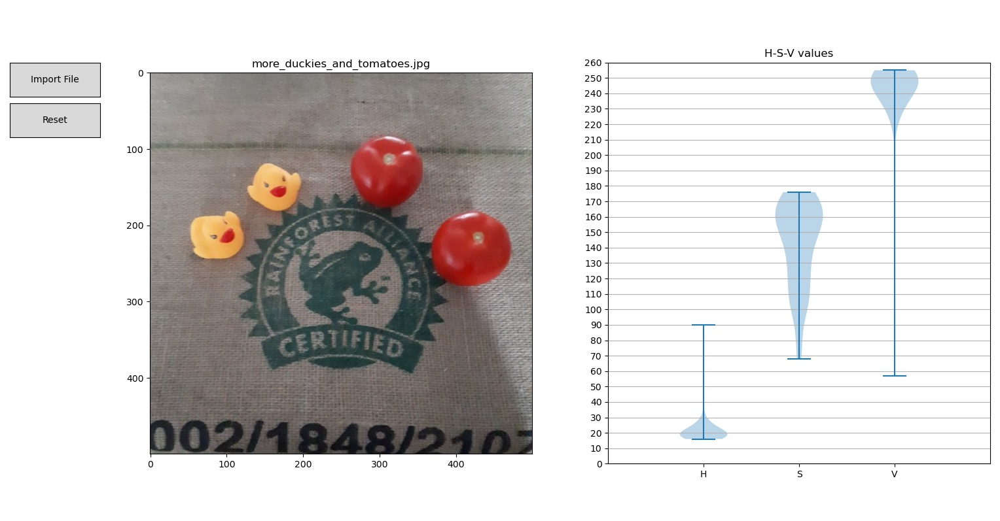

# Color Signature Tool

# Overview

Small Python GUI for extracting HSV values from an image. Run the script, load an image, select pixels. HSV values distributions will appear in a violin chart. Choose the best min/max values of each channel for building your filter.

HSV color channel values have the following ranges, which are the same as in OpenCV. [1]

H -> 0-179  
S -> 0-255  
V -> 0-255  

# Dependencies

Python 3  
matplotlib  
numpy  

# Install & Tutorial

1 - Clone this repository

    mkdir /color_signature_tool
    cd /color_signature_tool
    git clone https://github.com/martin0004/color_signature_tool.git

2 - Run the tool.

    python3 color_signature_tool.py

3 - A small GUI will open. Click on `Import File` and browse for your image.

4 - Click on pixels for which you want to know HSV values. As you click on pixels, the violin chart on the right will populate. Larger sections of a violin indicate more pixels with this value. In this example I am clicking on the duckies.

5 - If you have a 2nd images of the same object (say in different lighting conditions), import it and keep clicking on pixels. HSV values will be added to the ones which were already extracted.

6 - Then use engineering judgment to decide which range of values you want to use in your filter. In the example above, most of the V channnel values seem to be between 210 and 255. Values below 210 are most likely noise (or maybe one of the pixels I clicked on was just outside a duckie, so from a different color). Therefore I only use range 210-255 for channel V in my filter.

7 - Finally, build a filter with your favorite image library. The example below uses the Python cv2 module.

    $ cat filter_example.py

    import cv2
    import matplotlib.pyplot as plt
    import numpy as np

    # BGR and HSV images
    bgr = cv2.imread("../images/duckies_and_tomatoes.jpg")
    hsv = cv2.cvtColor(bgr, cv2.COLOR_BGR2HSV)
    # Matplotlib needs RGB image
    rgb = cv2.cvtColor(bgr, cv2.COLOR_BGR2RGB)

    h_min = 15
    h_max = 35
    s_min = 65
    s_max = 180
    v_min = 210
    v_max = 255

    lower = np.array([h_min, s_min, v_min])
    upper = np.array([h_max, s_max, v_max])

    mask = cv2.inRange(hsv, lower, upper)

    rgb_masked = np.copy(rgb)
    rgb_masked[mask == 0] = [0,0,0]

    plt.imshow(rgb_masked)
    plt.show()

    $ python3 filter_example.py

# Possible improvements

- Allow the user to select from more color channels and ranges from a picklist:

    RGB [255/255/255] -> RGB with channel values from 0-255  
    BGR [255/255/255] -> BGR with channel values form 0-255  
    RGBA [...] -> ...  
    HSV [179/255/255]  
    HSV [360/100/100]  
    ...

- Allow the user to create different sets of HSV signatures. As an example, the user could click on the duckies, then click on button "New set", then on the tomatoes, and the HSV values for tomatoes would be a different set of violins on the chart. This would help see overlap of signatures between different objects.

# References

[1] Educba, Introduction to OpenCV HSV range, https://www.educba.com/opencv-hsv-range/

